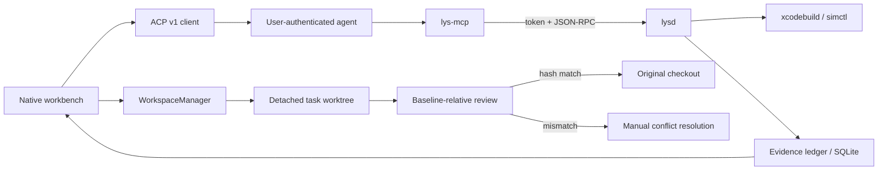
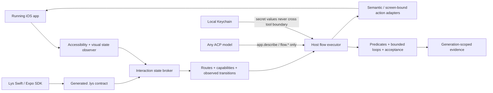

# Architecture

## Trustworthy task loop

`IOSDevCore` contains contracts and actors. `IOSDevApp` is the internal macOS target for the Lys product. `lysd` owns local Apple-tool execution and evidence. `lys-mcp` translates MCP tool calls into authenticated runtime RPC.

## Universal interaction architecture

The live app is the source of truth. Lys observes a new stable state after each interaction and
issues screen-bound capability IDs. SDK declarations generate human-stable screen and action IDs,
transition edges, protected authenticated-session setup, UI-authentication flows, parameters,
bounded loops, and terminal criteria; they cannot make an absent control actionable. Declared
`screen → resultsIn` edges form a safe graph that the host, not the model, plans across.

The MCP surface intentionally excludes Simulator lifecycle, raw hierarchy queries, selectors,
coordinates, and direct WDA calls. A declared flow is one `flow.run` call. Zero-integration testing
uses `flow.run`, bounded `flow.step` calls with exact host IDs, then `flow.finish`. This keeps speed
and correctness in the host and makes model choice an orchestration detail rather than a testing
capability decision.

## Invariants

1. Agent writes resolve inside a detached task worktree.
2. Executables are absolute URLs and arguments remain arrays.
3. Runtime transport is a mode-0600 Unix socket, never a TCP listener.
4. Every client connection authenticates with its task token before other calls.
5. Applying checks the current original entry against the exact baseline manifest. A mismatch is a conflict, never an overwrite.
6. Evidence has a mutation generation. Older evidence is stale.
7. Coordinate actions are exploratory, nondeterministic, and are not verification artifacts; semantic selectors and assertions remain machine-verifiable.
8. App Graph edges are observed, confidence-scored, build-scoped, deterministic, and invalidated on mismatch.
9. Credential ownership remains with the selected agent. Diagnostics are explicitly exported and redacted.
10. Lys contracts contain logical secret references only. Values resolve locally from Keychain and never enter prompts, tool results, or evidence.
11. Destructive and external Lys actions require explicit host approval; agent arguments cannot self-authorize risk.
12. A flow cannot complete without non-empty deterministic acceptance criteria and fresh host evidence.
13. Every acceptance criterion must pass; an agent response ending or an exploratory run can never produce trusted verification.

## Persistence

SQLite stores repository, task, event, evidence, and App Graph metadata in WAL mode. Result bundles, screenshots, transcripts, and logs belong in Application Support and are referenced by path. The store is actor-isolated around one full-mutex SQLite handle.

## Compatibility gates

`Manifests/wda-compatibility.json` may execute only entries with an exact Xcode build, source commit, checksum, patch set, runtime coverage, and a passing integration result. An absent entry disables semantic automation while preserving build/run/screenshots. `Manifests/adapter-lock.json` follows the same deny-by-default release promotion rule.
