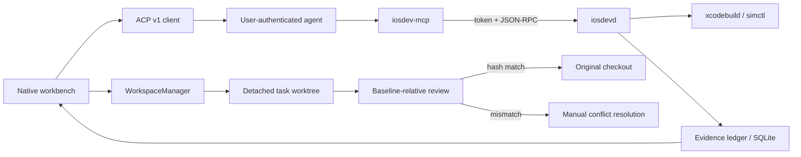

# Architecture

## Trustworthy task loop

`IOSDevCore` contains contracts and actors. `IOSDevApp` is the macOS client. `iosdevd` owns local Apple-tool execution and evidence. `iosdev-mcp` translates MCP tool calls into authenticated runtime RPC.

## Invariants

1. Agent writes resolve inside a detached task worktree.
2. Executables are absolute URLs and arguments remain arrays.
3. Runtime transport is a mode-0600 Unix socket, never a TCP listener.
4. Every client connection authenticates with its task token before other calls.
5. Applying checks the current original entry against the exact baseline manifest. A mismatch is a conflict, never an overwrite.
6. Evidence has a mutation generation. Older evidence is stale.
7. Coordinate actions are exploratory, nondeterministic, and are not verification artifacts; semantic selectors and assertions remain machine-verifiable.
8. App Graph edges are observed, confidence-scored, build-scoped, deterministic, and invalidated on mismatch.
9. Credential ownership remains with the selected agent. Diagnostics are explicitly exported and redacted.

## Persistence

SQLite stores repository, task, event, evidence, and App Graph metadata in WAL mode. Result bundles, screenshots, transcripts, and logs belong in Application Support and are referenced by path. The store is actor-isolated around one full-mutex SQLite handle.

## Compatibility gates

`Manifests/wda-compatibility.json` may execute only entries with an exact Xcode build, source commit, checksum, patch set, runtime coverage, and a passing integration result. An absent entry disables semantic automation while preserving build/run/screenshots. `Manifests/adapter-lock.json` follows the same deny-by-default release promotion rule.
